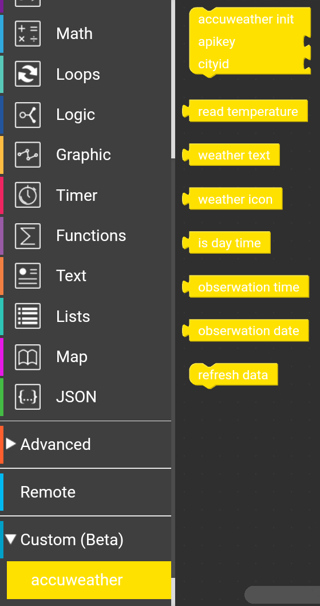

# Custom block for the UiFlow environment to support REST API connect with accuweather.com weather service.

**accuweather init** - Use this block as first (before blocks listed below). Set Api Key, cityID and other functions to use with other blocks.

**refresh data** - connect to accuweather.com service and download actual weather data for given city (in init block). Data is stored locally. Blocks below returns these stored data.

**read temperature** - return temperature for given city.

**weather text** - return weather text description.

**weather icon** - return number of icon (only number, not icon), you can use this block to display custom icons depending of actual eather.

**is day time** - Return true if given city actually is a day time. Otherwise return false.

**obserwation date** - return obserwation date as string (format: *YYYY-MM-DD*)

**obserwation time** - return obserwation date as string (format: *HH-MM-SS*)

## Api Key, city ID, weather icons and their numbers.

### How to get your Api Key:
 - create account on https://developer.accuweather.com/user/login
 - after create account and login click "add new app" and get API Key
 
 In free trial accuweather account you have a 50 requests per day limit (in this case 50 times usign block: **refresh data**)

### How to find city ID for your city:
 - open https://developer.accuweather.com/accuweather-locations-api/apis/get/locations/v1/cities/search
 - fill field **apikey** with your api key and **q** with your city name to search in *Query Parameters* section
 - click **Send this request**

### Icon list:
List of icons and their numbers used by accuweather.com
[https://developer.accuweather.com/weather-icons](https://developer.accuweather.com/weather-icons)

## Blocks

Custom block file: [accuweather.m5b](accuweather.m5b)

