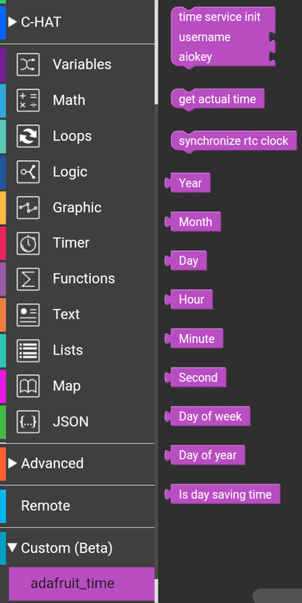

# Adafruit IO Time Service

M5stickC custom blocks for retrieving time from the time service from adafruit.io. An account on adafruit.io and a username along with the aio key are required for operation. Downloaded time may be delayed by 1-2 seconds due to REST API request handling time.
Returned time reffer to location which you set in your adafruit.io profile.

**time service init** - Define functions used by below blocks. Requite *username* and *aiokey* from adafruit.io account. You must use this block before use other blocks.

**get actual time** - get actual time and store it in local memory for later use with **Year**, **Month**, **Day**, **Hour** etc blocks.

**synchronize rtc clock** - get actual time and set internal rtc clock (tested only on m5stickc)

**Year, Month, Day, Hour, Minute, Second** - return stored values for retreived time by *get actual block* (time at the moment of use this block)

**Day of week** - return day of the week number

**Day of year** - return day of the year number

**is day saving time** - return **1** if in your time zone is day saving time used now.

## Block

Block file: [adafruittime.m5b](adafruittime.m5b) based on [ada_time.py](ada_time.py)

