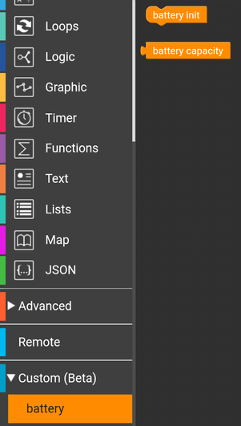

# M5stickC battery capacity 

- **baterry init** - initialise/define function to later use by below block.
- **battery capacity** - return internal battery "capacity" in percents. Return values in range **0..100** with 5% step. Function could return **-1** if battery voltage is too low to normal operate (dead) or **101** when battery voltage is too high (overcharged)

## Block

block file: [battery.m5b](battery.m5b) based on [battery.py](battery.py) source code.

