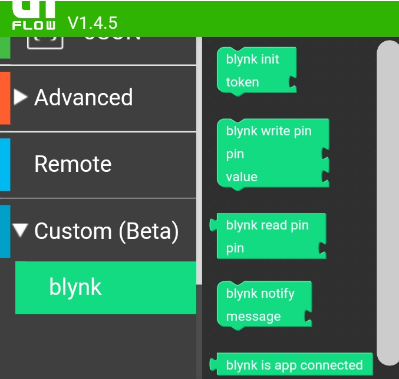
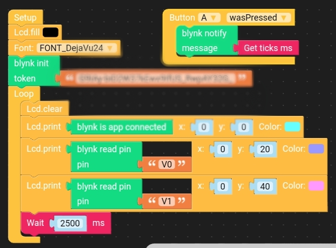

# Custom block for the UiFlow environment to support communication with Blynk. Communication is carried out using REST API requests

 The communication is operated with five blocks:

 **blynk init** - initialization of the blynk with AUTH TOKEN. This block is required for the rest of the blocks to function properly.

 **blynk write pin** - write a **value** to **pin** (pin variable must be a string like "V0").

 **blynk read pin** - return a last stored **pin** value (pin variable must be a string like "V0").

 **blynk notify** - sends a notify to blynk application with given **message** (at this moment block correctly sends only digits and letters)

 **blynk is app connected** - test if blynk application (on smartphone) is connected to blynk server. This block return value as string "true" or "false" (they are not boolean logical values)

### NOTICES

 - It takes some time to send and receive requests (approximately one second).  It is not recommended to use blocks directly in functions that display text on the display (in the example program these delays are clearly visible).  It's best to use them indirectly by saving the received values ​​to variables for later display.

 - **blynk read pin** works correctly with blynk objects that return a one value from pin. There is a issue with the reading of pins assigned to objects of type zeRGB, LCD, which on the request of reading a specific pin return values ​​for all the pins assigned to them.

 - If the **blynk init** block is not used before other blynk blocks your program will be terminated with an error.  This block defines the functions that are used by the rest of the blynk blocks.

 - function **blynk read pin** may return a string with text description of the error from the server instead of the pin value in case of an incorrect token or an attempt to refer to a non-existing pin

 - I tested these blocks with only **virtual pins**

## Blocks

Custom block file: [blynk.m5b](blynk.m5b)

## Example application

Example file: [example.m5f](example.m5f)

Python source code used to create this custom blocks: 

