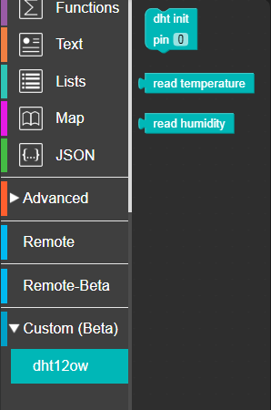
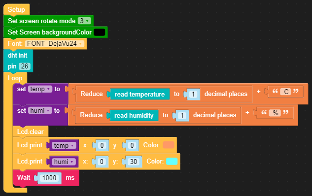
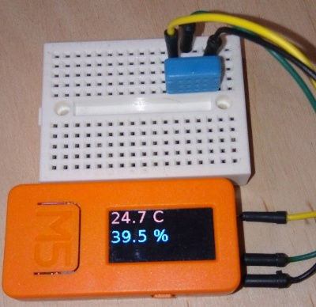

# Custom block for the UiFlow environment to support the DHT12 temperature and humidity sensor.

 The sensor is operated with three blocks:

 **dht init** - initialization of the pin to which the sensor is connected.  Place this block somewhere at the beginning of the program

 **read temperature** - return temperature reading from the sensor.

 **read humidity** - return humidity reading from the sensor.

 **IMPORTANT:** This blocks and the code uses only "one-wire" bus for communication with sensor.

## Blocks

Custom block file: [dht12ow.m5b](dht12ow.m5b)

## Example application

Example file: [dht12ow.m5f](dht12ow.m5f)

