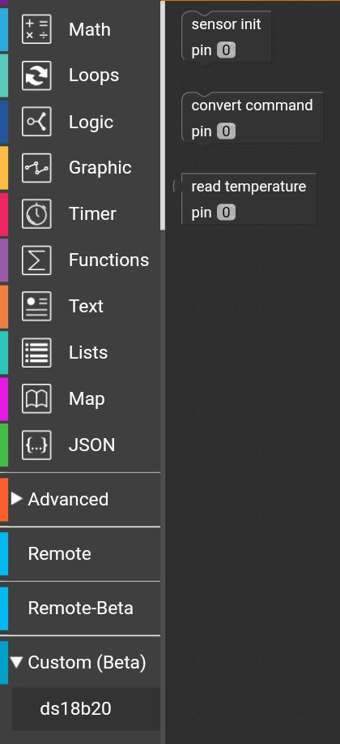
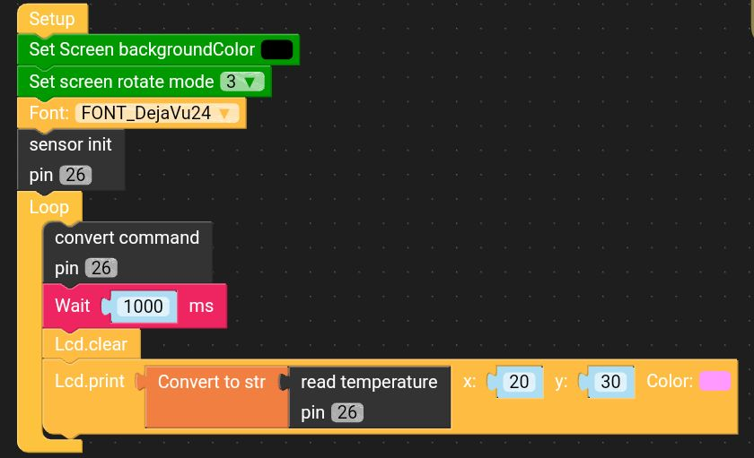

# Custom block for the UiFlow environment to support the ds18b20 temperature sensor.

 The sensor is operated with three blocks:
 As a parameter for each block use the gpio pin number to which the sensor is connected.

 **sensor init** - initialization of the pin to which the sensor is connected.  Place this block somewhere at the beginning of the program

 **convert command** - sends a command initiating the process of reading and converting the temperature by the sensor.  Use the block before each temperature reading

 **read temperature** - proper temperature reading from the sensor.  The correct temperature reading should occur 750ms after using the convert command block.

 **IMPORTANT:** This is a simplified version for operating the temperature sensor and has some limitations:
 - correctly supports only ds18b20 model
 - reads only temperature (other features like alarms are not supported)
 - supports only one sensor per line
 - does not support the power mode of the parasitic sensor

## Blocks

Custom block file: [ds18b20.m5b](ds18b20.m5b)

## Example application

Example file: [example.m5f](example.m5f)

